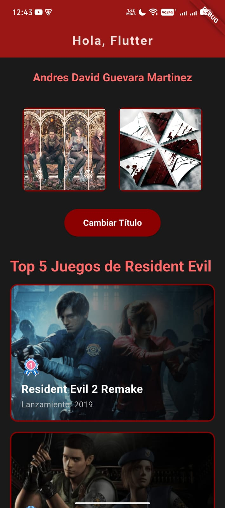
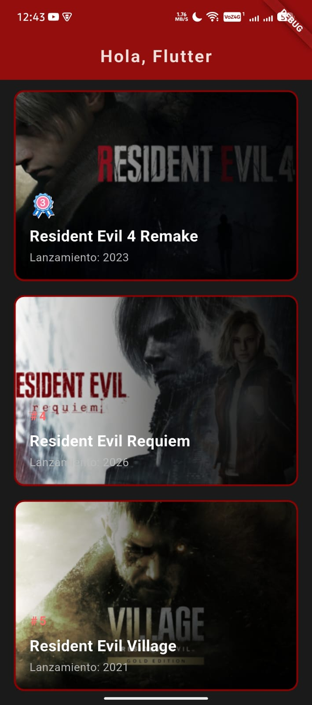
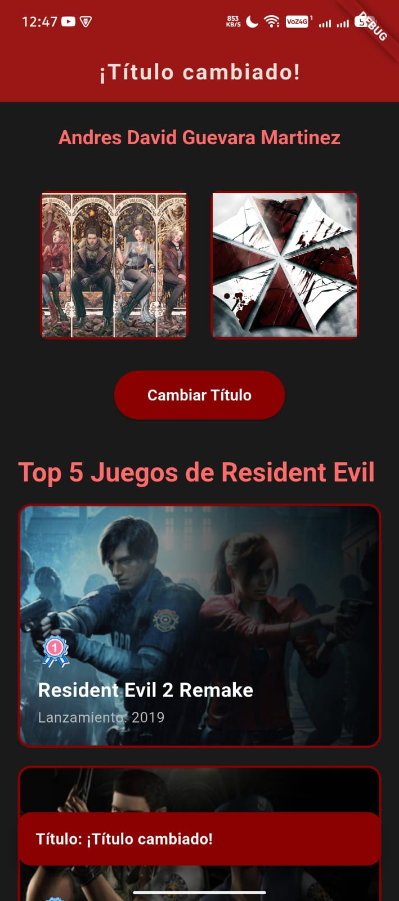

# Resident Evil - Top 5 Juegos

Una aplicación Flutter que muestra mi top 5 mejores juegos de la saga Resident Evil.

## 🎮 Descripción

Esta es una aplicación móvil desarrollada en Flutter que presenta mi lista del top 5 juegos más destacados de la franquicia Resident Evil. La app implementa conceptos fundamentales de Flutter como:

- **Estado con setState()**: Demostración clara del patrón de cambio de estado en widgets estatefulwidgets
- **Widget personalizado**: Componente `ResidentEvilGameCard` reutilizable para mostrar cada juego
- **Imágenes y Assets**: Carga de imágenes desde red y assets locales
- **Efectos visuales**: Gradientes lineales, blur effects

## 🎬 Mi Top 5 Juegos

1. **Resident Evil 2 Remake** (2019) - 🥇
   - Icono personalizados para ranking
   
2. **Resident Evil 1 Remake** (2002) - 🥈
   - Clásico del género survival horror
   
3. **Resident Evil 4 Remake** (2023) - 🥉
   - Revolucionó el género con mecánicas innovadoras
   
4. **Resident Evil Requiem** (2026)
   - Último lanzamiento de la saga
   
5. **Resident Evil Village** (2021)
   - Experiencia next-gen inmersiva

## 🎨 Características de Diseño

### Estética Resident Evil
- Paleta de colores oscura (#1a1a1a, #8B0000)
- Tipografía bold y letterSpacing para impacto
- Gradientes horizontales con blur effect

### Cards Temáticos
- Imagen de fondo del juego
- Gradiente transparente → negro para text overlay
- Icono o número de posición (primeros 3 tienen iconos)
- Nombre comercial y año de lanzamiento
- BorderRadius redondeado con borde rojo oscuro

### AppBar Interactivo
- Título dinámico que alterna entre "Hola, Flutter 1.0.1" y "¡Título cambiado!"
- Botón que demonstra setState()
- Fondo rojo oscuro (#8B0000)
- Elevation de 10 para profundidad

### SnackBar Mejorado
- Comportamiento flotante en la pantalla
- Esquinas redondeadas (12px border radius)
- Fondo rojo oscuro con texto blanco bold
- Margin y elevation para mejor visibilidad

---

### Conceptos implementados

**1. StatefulWidget y setState()**
```dart
class MyHomePage extends StatefulWidget {
  @override
  State<MyHomePage> createState() => _MyHomePageState();
}

class _MyHomePageState extends State<MyHomePage> {
  String _appBarTitle = "Hola, Flutter 1.0.1";
  
  void _toggleTitle() {
    setState(() {
      _appBarTitle = _appBarTitle == "Hola, Flutter 1.0.1"
          ? "¡Título cambiado!"
          : "Hola, Flutter 1.0.1";
    });
  }
}
```

**2. Modelo de datos**
```dart
class ResidentEvilGame {
  final String titulo;
  final String nombreComercial;
  final int anioLanzamiento;
  final String rutaImagen;
  final String? iconPath;
  
  ResidentEvilGame({
    required this.titulo,
    required this.nombreComercial,
    required this.anioLanzamiento,
    required this.rutaImagen,
    this.iconPath,
  });
}
```

**3. Efectos visuales con Stack y BackdropFilter**
```dart
Stack(
  children: [
    Image.asset(game.rutaImagen),  // Imagen de fondo
    ClipRRect(
      borderRadius: BorderRadius.circular(12),
      child: BackdropFilter(
        filter: ImageFilter.blur(sigmaX: 0.5, sigmaY: 0.5),
        child: Container(
          decoration: BoxDecoration(
            gradient: LinearGradient(
              colors: [Colors.transparent, Colors.black.withOpacity(0.9)],
            ),
          ),
        ),
      ),
    ),
    // Texto superpuesto
  ],
)
```
---

## 📱 Capturas de Pantalla

### Pantalla 1: Vista Principal


### Pantalla 2: Cards de Juegos


### Pantalla 3: Interacción



## 🎯 Conceptos Aprendidos

### setState()
El patrón central de la app. Al presionar el botón "Cambiar Título", se invoca:
```dart
setState(() {
  _appBarTitle = _appBarTitle == "Hola, Flutter 1.0.1"
      ? "¡Título cambiado!"
      : "Hola, Flutter 1.0.1";
});
```

### Widgets Personalizados
- `ResidentEvilGame`: Modelo de datos
- `ResidentEvilGameCard`: StatelessWidget que renderiza cada juego con Stack, ClipRRect, BackdropFilter y LinearGradient

### Layouts
- `SingleChildScrollView`: Scroll vertical
- `Column` y `Row`: Layouts responsivos
- `ListView.builder`: Lista dinámica
- `Stack` y `Positioned`: Composición compleja de widgets

## 📋 Requisitos

- Flutter 3.11.3 o superior
- Dart 3.x
- Android SDK / Xcode (según plataforma)

## 🚀 Ejecución

```bash
# Obtener dependencias
flutter pub get

# Ejecutar en dispositivo conectado
flutter run

# Ejecutar en modo release
flutter run --release
```

## 📂 Estructura de Carpetas

```
taller_1/
├── lib/
│   └── main.dart          # Código principal
├── assets/
│   └── images/            # Imágenes de juegos e iconos
├── capturas/              # Screenshots de la app
│   ├── cap1.jpeg
│   ├── cap2.jpeg
│   ├── cap3.jpeg
│   └── cap4.jpeg
├── pubspec.yaml           # Dependencias
└── README.md              # Este archivo
```

## 👤 Autor

Andres David Guevara Martinez

## 📦 Distribución de APK con Firebase App Distribution

### Flujo de Trabajo
El proceso de distribución sigue el siguiente flujo:
`Generar APK -> App Distribution -> Testers -> Instalación -> Actualización`

### Publicación
Para replicar el proceso de publicación en el equipo:
1. Ejecutar el comando de build: `flutter build apk`
2. Ir a Firebase Console -> App Distribution.
3. Subir el archivo `app-release.apk` generado en `build/app/outputs/flutter-apk/`.
4. Asignar el release a los testers o grupos correspondientes (ej. grupo `QA_Clase` con el tester `dduran@uceva.edu.co`).
5. Añadir las Release Notes y distribuir.

### Notas sobre Versionado
- Se ha actualizado la versión en `pubspec.yaml` de `1.0.0+1` a `1.0.1+2` para simular la actualización.
- Formato de Release Notes utilizado: Detalle de cambios por versión y fecha.

### Bitácora de QA
- **Versión**: 1.0.1+2
- **Fecha**: 3 de Mayo de 2026
- **Cambios**: Se añadió el permiso de INTERNET en `AndroidManifest.xml` y se incrementó la versión en `pubspec.yaml`.
- **Incidencias**: Ninguna incidencia bloqueante encontrada durante la generación del APK.
- **Estado de pruebas**: APK de release generado correctamente y listo para ser distribuido a los testers.