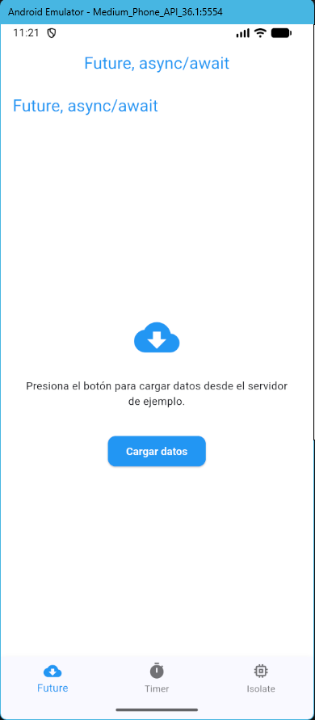
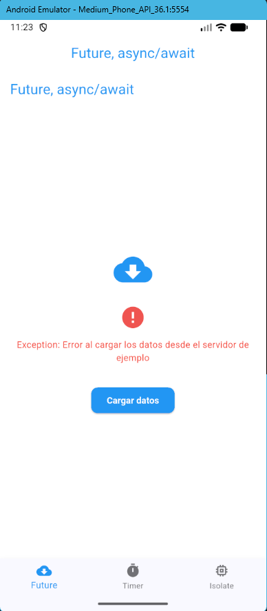
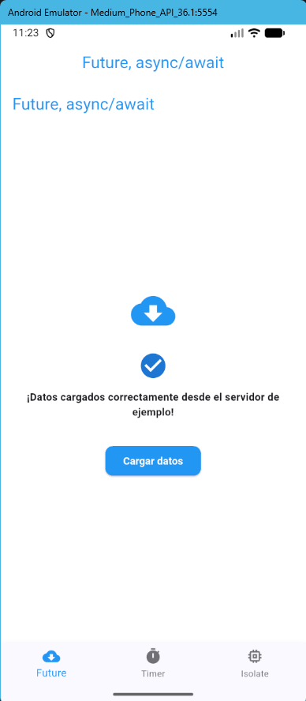
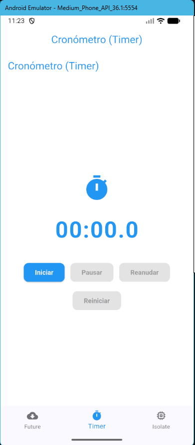
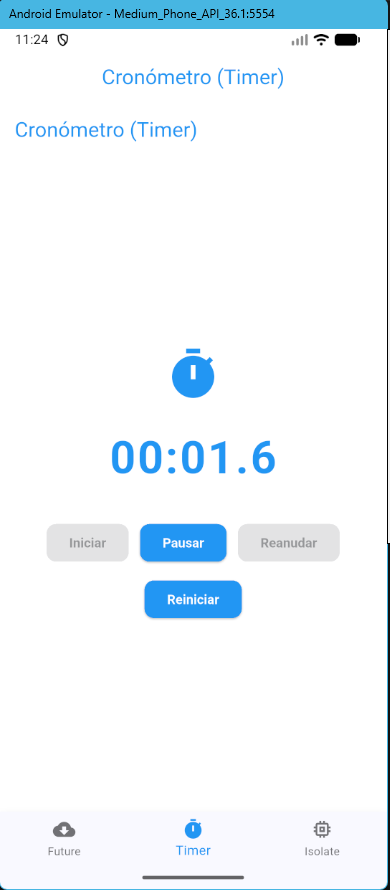
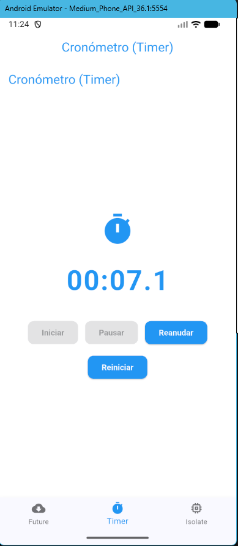
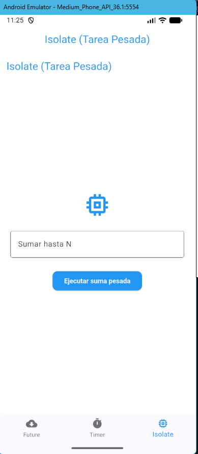
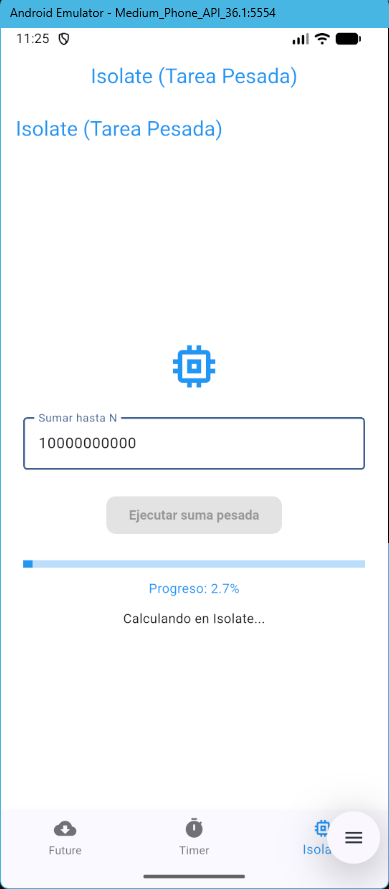

# Taller 3 - Segundo plano, asincronía y servicios en Flutter

Aplicación Flutter que demuestra:

## 🚩 Objetivo

Demostrar el uso de segundo plano y asincronía en Flutter:


## 🧩 Estructura de la App

La app tiene 3 pantallas principales:

1. **Carga asíncrona (Future/async/await)**
  - Simula la consulta a un servidor
  - Muestra estados: "Cargando datos desde el servidor de ejemplo...", éxito y error
  - Usa Future.delayed y async/await
  - Imprime en consola el orden de ejecución

2. **Cronómetro (Timer)**
  - Botones: Iniciar, Pausar, Reanudar, Reiniciar
  - Actualización cada 100 ms
  - El botón Iniciar se deshabilita si Reanudar está activo
  - El estado se mantiene aunque cambies de pantalla

3. **Isolate (Tarea Pesada)**
  - Suma de 1 hasta N en un Isolate
  - Barra de progreso y porcentaje
  - El estado se mantiene aunque cambies de pantalla
  - Previene errores de setState tras dispose


## Capturas de Pantalla


### Carga asíncrona (Future/async/await)
  
  
  

### Cronómetro (Timer)
  
  
  

### Isolate (Tarea pesada)
  
  


## 📝 Explicación de conceptos

### ¿Cuándo usar cada uno?

  - Cuando necesitas esperar una operación asíncrona (consultar API, leer archivos, etc.) sin bloquear la UI.
  - Ejemplo: cargar datos de un servidor.

  - Para tareas periódicas o temporizadas (cronómetros, countdowns, animaciones simples).
  - Ejemplo: cronómetro que actualiza cada 100 ms.

  - Para tareas CPU-bound pesadas (procesamiento de datos, cálculos grandes) que bloquearían la UI si se ejecutan en el hilo principal.
  - Ejemplo: suma de 1 hasta N con barra de progreso.


## 🗂️ Estructura de Carpetas

```
taller_3/
├── lib/
│   └── main.dart          # Código principal
├── assets/
│   └── images/            # Imágenes (si aplica)
├── capturas/              # Screenshots de la app
│   ├── cap1.jpeg
│   ├── cap2.jpeg
│   └── cap3.jpeg
├── pubspec.yaml           # Dependencias
└── README.md              # Este archivo
```

---

## 🚀 Ejecución

```bash
flutter pub get
flutter run
```


## 👤 Autor

Andres David Guevara Martinez

**1. StatefulWidget y setState()**
```dart
class MyHomePage extends StatefulWidget {
  State<MyHomePage> createState() => _MyHomePageState();
}

class _MyHomePageState extends State<MyHomePage> {
  String _appBarTitle = "Hola, Flutter";
  
  void _toggleTitle() {
    setState(() {
      _appBarTitle = _appBarTitle == "Hola, Flutter"
          ? "¡Título cambiado!"
          : "Hola, Flutter";
    });
  }
}
```

**2. Modelo de datos**
```dart
class ResidentEvilGame {
  final String titulo;
  final String nombreComercial;
  final int anioLanzamiento;
  final String rutaImagen;
  final String? iconPath;
  
  ResidentEvilGame({
    required this.titulo,
    required this.nombreComercial,
    required this.anioLanzamiento,
    required this.rutaImagen,
    this.iconPath,
  });
}
```

**3. Efectos visuales con Stack y BackdropFilter**
```dart
Stack(
  children: [
    Image.asset(game.rutaImagen),  // Imagen de fondo
    ClipRRect(
      borderRadius: BorderRadius.circular(12),
      child: BackdropFilter(
        filter: ImageFilter.blur(sigmaX: 0.5, sigmaY: 0.5),
        child: Container(
          decoration: BoxDecoration(
            gradient: LinearGradient(
              colors: [Colors.transparent, Colors.black.withOpacity(0.9)],
            ),
          ),
        ),
      ),
    ),
    // Texto superpuesto
  ],
)
```
---

## 📱 Capturas de Pantalla

### Pantalla 1: Vista Principal


### Pantalla 2: Cards de Juegos


### Pantalla 3: Interacción


## 🎯 Conceptos Aprendidos

### setState()
El patrón central de la app. Al presionar el botón "Cambiar Título", se invoca:
```dart
setState(() {
  _appBarTitle = _appBarTitle == "Hola, Flutter"
      ? "¡Título cambiado!"
      : "Hola, Flutter";
});
```

### Widgets Personalizados
- `ResidentEvilGame`: Modelo de datos
- `ResidentEvilGameCard`: StatelessWidget que renderiza cada juego con Stack, ClipRRect, BackdropFilter y LinearGradient

### Layouts
- `SingleChildScrollView`: Scroll vertical
- `Column` y `Row`: Layouts responsivos
- `ListView.builder`: Lista dinámica
- `Stack` y `Positioned`: Composición compleja de widgets

## 📋 Requisitos

- Flutter 3.11.3 o superior
- Dart 3.x
- Android SDK / Xcode (según plataforma)

## 🚀 Ejecución

```bash
# Obtener dependencias
flutter pub get

# Ejecutar en dispositivo conectado
flutter run

# Ejecutar en modo release
flutter run --release
```

## 📂 Estructura de Carpetas

```
taller_1/
├── lib/
│   └── main.dart          # Código principal
├── assets/
│   └── images/            # Imágenes de juegos e iconos
├── capturas/              # Screenshots de la app
│   ├── cap1.jpeg
│   ├── cap2.jpeg
│   ├── cap3.jpeg
│   └── cap4.jpeg
├── pubspec.yaml           # Dependencias
└── README.md              # Este archivo
```

## 👤 Autor

Andres David Guevara Martinez